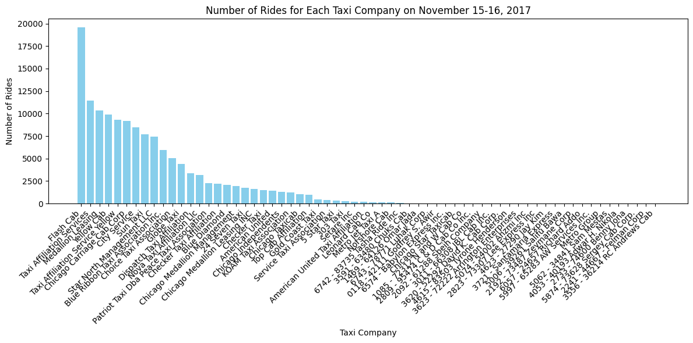
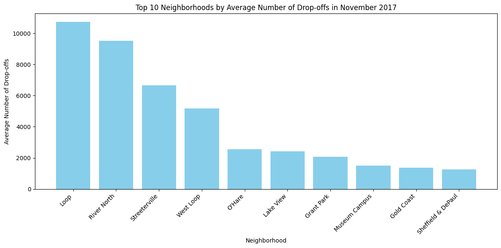

# Ride-Sharing Trends in Chicago: SQL & Data Collection Project

## Table of Contents
- [Overview](#overview)
- [Business Problem](#business-problem)
- [Dataset](#dataset)
- [Exploratory Data Analysis (EDA)](#exploratory-data-analysis-eda)
- [Hypothesis Testing](#hypothesis-testing)
- [Results & Key Insights](#results--key-insights)
- [Next Steps & Potential Improvements](#next-steps--potential-improvements)
- [How to Use](#how-to-use)
- [Connect With Me](#connect-with-me)

---

## Overview
This project analyzes **Chicago taxi ride data** and **weather conditions** to uncover trends in ride frequency, company performance, and external factors influencing ride durations. The analysis includes SQL-based data retrieval, hypothesis testing, and visualization.

## Business Problem
Zuber, a new ride-sharing startup, is looking to gain insights from **Chicago taxi ride data** to understand:
- **Passenger preferences & behavior**
- **Impact of weather conditions on ride frequency**
- **Top-performing taxi companies and neighborhoods for drop-offs**
- **Duration differences in rides to O'Hare on rainy vs. clear Saturdays**

By leveraging SQL queries and statistical analysis, the study provides **actionable insights** to optimize ride allocation strategies.

## Dataset
The analysis utilizes a **relational database** consisting of:
- **neighborhoods**: Neighborhood ID & names
- **cabs**: Taxi companies and vehicle details
- **trips**: Ride start times, end times, distance, duration, pickup & drop-off locations
- **weather_records**: Hourly temperature and weather descriptions

Additionally, SQL queries were executed to extract structured datasets for deeper analysis in Python:
- `project_sql_result_01.csv`: Taxi companies & ride counts for November 15-16, 2017.
- `project_sql_result_04.csv`: Drop-off locations & average rides in November 2017.
- `project_sql_result_07.csv`: Rides from the **Loop** to **O'Hare Airport**, categorized by weather conditions.

---

## Exploratory Data Analysis (EDA)
### **Taxi Company Ride Analysis**
- **Flash Cab & Taxi Affiliation Services** were the dominant taxi companies.
- "Yellow" and "Blue" branded companies had a strong presence.
- The majority of rides were completed by a few major taxi firms.

#### **Top Taxi Companies by Rides**

### **Drop-off Location Analysis**
- **The Loop, River North, and Streeterville** had the **highest number of drop-offs**.
- These areas correspond to Chicago's **business and nightlife districts**.

#### **Top 10 Drop-off Neighborhoods**

---

## Hypothesis Testing
**Hypothesis:**  
*"The average duration of rides from the Loop to O'Hare International Airport changes on rainy Saturdays."*

- **Method:** Two-sample t-test comparing ride durations on rainy vs. clear Saturdays.
- **Significance Level (α):** 0.05
- **Results:** No statistically significant difference was found, indicating **weather did not strongly impact ride duration**.

---

## Results & Key Insights
- **Flash Cab and Taxi Affiliation Services dominate the Chicago market.**
- **The Loop, River North, and Streeterville** are prime ride destinations.
- **Weather conditions had minimal impact on ride duration** from the Loop to O'Hare.

### **Business Recommendations**
- **Optimize ride supply** in high-demand areas like River North & Streeterville.
- **Consider strategic partnerships** with major taxi firms to increase market penetration.
- **Further investigate service quality issues** beyond weather-related delays.

---

## Next Steps & Potential Improvements
- **Incorporate real-time ride data** to track seasonal fluctuations.
- **Analyze fare pricing strategies** and their impact on ride demand.
- **Evaluate traffic congestion** as a potential factor affecting ride durations.

---

## How to Use
### Clone the repository:
    git clone https://github.com/rhi-222/sql-data-collection.git

### Install dependencies:
    pip install pandas numpy matplotlib seaborn scipy
    
### Run the Jupyter Notebook:
- Open `DataCollection(SQL).ipynb` in Jupyter Notebook.
- Execute the notebook to analyze SQL query results, generate insights, and visualize trends.

## Connect With Me
📧 Email: rhiannon.filli@gmail.com

💼 LinkedIn: linkedin.com/in/rhiannonfilli
